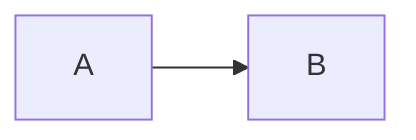

---

layout: post

​title: Mermaid画流程图语法

tags:

- 电脑技术

---


在markdown下使用mermaid绘制流程图flowchart，通过javascript实现图表的生成，是一种简便实用的方法。

## 基本语法分类

- 方向申明
- 节点与形状
- 连接线
- 特殊语法
- 子图语法
- 基础fontawesome支持语法

### 方向申明

`graph 方向代码`

方向代码有：

- TB: top-bottom 从上到下
- BT: bottom-top从下到上
- RL: right-left从右到左
- LR: left-right从左到右
- TD: same as TB从上到下

例如：

```
graph LR
​	A-->B
```

<div class="mermaid">

    graph LR

          A-->B

</div>


### 节点与形状

分为：

- 默认节点：仅有`id`
- 文本节点：又称矩形节点，用`id[文本内容]`
- 圆角节点：用`id(文本内容)`
- 圆节点：用`id((文本内容))`
- 右向旗帜节点：用`id>文本内容]`
- 菱形节点：用`id{文本内容}`

例如：

```
graph TB
​		id1
​		id2[这是矩形节点]
​		id3(这是圆角节点)
​		id4((这是圆节点))
​		id5>这是右向旗帜节点]
​		id6{这是菱形节点}
```
​		
<div class="mermaid">
	graph TB
		id1
		id2[这是矩形节点]
		id3(这是圆角节点)
		id4((这是圆节点))
		id5>这是右向旗帜节点]
		id6{这是菱形节点}
</div>


### 连接线

节点间的连接线有多种形状，并可以在连接线中加入标签：

#### 箭头形连接

```
graph LR
​	A-->B
```

<div class="mermaid">
graph LR
	A-->B
</div>




#### 无箭头连接

```
graph LR
​	A---B
```


<div class="mermaid">
graph LR
	A---B
</div>


#### 带标签连接

```
graph LR
​	A--这是标签---B
```

需注意，标签前面是两短横，后面是三短横。

<div class="mermaid">
graph LR
	A--这是标签---B
</div>


#### 带箭头标签连接

```
graph LR
​	A--这是标签-->B
```

需注意，标签前面是两短横，后面是两短横与一">"号。

<div class="mermaid">
graph LR
	A--这是标签-->B
</div>


#### 虚线连接
##### 虚线带箭头连接

```
graph LR
​	A-.->B
```


<div class="mermaid">
graph LR
	A-.->B
</div>


##### 虚线无箭头连接

```
graph LR
​	A-.-B
```


<div class="mermaid">
graph LR
	A-.-B
</div>


##### 虚线带标签连接

```
graph LR
​	A-.这是标签.-B
```


<div class="mermaid">
graph LR
	A-.这是标签.-B
</div>


##### 虚线带标签带箭头连接
```
graph LR
​	A-.这是标签.->B
```


<div class="mermaid">
graph LR
	A-.这是标签.->B
</div>


#### 粗实线连接

语法与上类似，只是将其中“-”改为“="即可。示例略。

### 特殊语法

- 使用引号可以抑制一些特殊的字符使用，避免歧义。
- 转义字符可以使用

### 子图语法(subgraph)

```
subgraph title
​	graph definition
  end
```

示例：

```
graph TB
​		subgraph 子图1
​		a1 -->a2[fa:fa-ban forbidden]
​		end
​		subgraph 子图2
​		b1-->b2[fa:fa-spinner spinner]
​		end
​		subgraph 子图3
​		c1-->c2["fa:fa-twitter for peace"]
​		end
​		c1-->a2​		
```

<div class="mermaid">
	graph TB
		subgraph 子图1
		a1 -->a2[fa:fa-ban forbidden]
		end
		subgraph 子图2
		b1-->b2[fa:fa-spinner spinner]
		end
		subgraph 子图3
		c1-->c2["fa:fa-twitter for peace"]
		end
		c1-->a2
</div>


### 基础fontawesome支持语法

要加入来自fontawesome的图表字体，需要作如上引用。

引用的语法为：fa:#icon class name#


*以上内容摘自网络*
